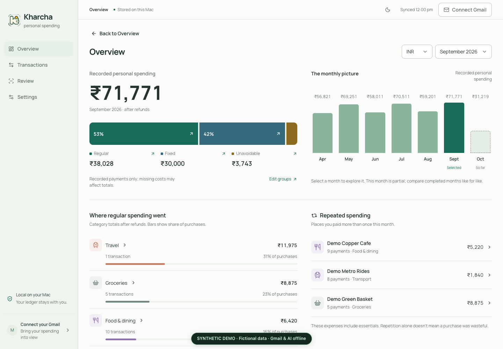

# Kharcha

A local-first personal spending tracker for macOS.

I built Kharcha to answer two simple questions: **How much am I spending each month, and where is my money going?**

I wanted a tracker that runs on my Mac and keeps my spending data locally, without uploading it to a separate budgeting service.

## What it does

- Shows a monthly overview with spending composition, category and merchant
  breakdowns, and charts that open the payments behind each amount.
- Imports transactions from Gmail and bank statements.
- Lets me review and correct transactions, handle shared expenses, and track refunds.
  Corrections save automatically, with explicit choices for remembering a payee's
  category and Undo for the last correction.
- Supports exports and encrypted backups.
- Provides light and dark themes, responsive phone layouts, and bottom navigation
  for Overview, Transactions, Review, and Settings.

Choose a month and currency to keep the overview, supporting transactions and
optional AI insights focused on the same period. Browsing a month does not start
an AI review.

[View the mobile layout](docs/screenshots/redesign-mobile.png). Both screenshots
use the isolated synthetic demo, with Gmail and AI offline.

## Local first

The app, transaction database, and imported email cache live on your Mac. Gmail credentials are stored in macOS Keychain. Core tracking and reports run locally; Gmail sync connects to Google to fetch emails.

Sync reads received mail locally to find transactions, including unfamiliar senders and subjects. It saves authenticated transaction evidence and discards unrelated or unconfirmed mail without keeping a personal-email review archive.

Online features are explicit choices. Connecting Gmail fetches emails from Google; merchant search sends a sanitized merchant label and category list to Codex for public web search, without transaction amounts, account fields, references, notes, or email bodies.

**AI insights are optional and off by default.** Before enabling them, you’ll see what is sent to OpenAI through Codex: spending details and summaries, merchant history, and saved financial context, including names and notes. You can preview the input locally. Enabling allows recurring reviews; turning it off stops future reviews but cannot retract data already sent. Core tracking works without AI.

## Get started

You’ll need macOS, Python 3.11+, and Node.js 22.13+ with npm. The first setup needs an internet connection.

1. Download or clone this repository.
2. Double-click **Start Kharcha.command** and keep its window running.
3. Open **Settings** to connect Gmail, or import a bank statement.

For Gmail setup, detailed features, and troubleshooting, see the [guide](docs/guide.md).

Imported transactions may need corrections. Review anything unclear before relying on the totals.

## Use it on your phone

Keep Kharcha running on an awake Mac and connect your phone to the same private
Wi-Fi network. The Mac keeps the ledger; approved phone edits update that same
ledger over a separate HTTPS connection.

1. On the Mac, open **Settings → Mobile access** and follow **First-time
   certificate setup**. Transfer and trust only the certificate from your Mac.
2. Choose **Pair a phone**, scan the QR code, and request access on the phone.
3. Compare the code on both screens and approve the matching request on the Mac.

Wi-Fi access is enabled by default, but phones cannot read the ledger before
approval. Invitations expire after five minutes. Turning access off disconnects
paired phones; restarting the app or changing networks requires fresh pairing.
Gmail sign-in, device management, backups, restore and deleting all data remain
Mac-only. No Internet hosting or router port forwarding is required.

For a desktop-only launch, use `python3 scripts/launch.py --no-mobile` or set
`MONTHLYCOST_MOBILE=0`. See the [phone setup guide](docs/guide.md#use-kharcha-on-your-phone)
for certificate instructions, session limits and troubleshooting.

## Contributing and license

See [CONTRIBUTING.md](CONTRIBUTING.md) for development setup and checks, and
[SECURITY.md](SECURITY.md) for privacy details and vulnerability reporting.

Kharcha is open source under the [MIT license](LICENSE). The bundled Manrope
font is covered by its [SIL Open Font License](frontend/public/fonts/OFL-Manrope.txt).
