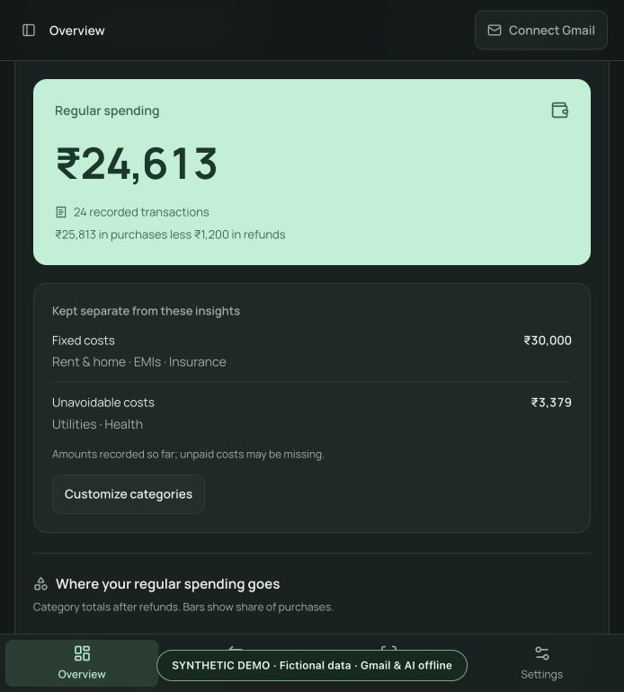
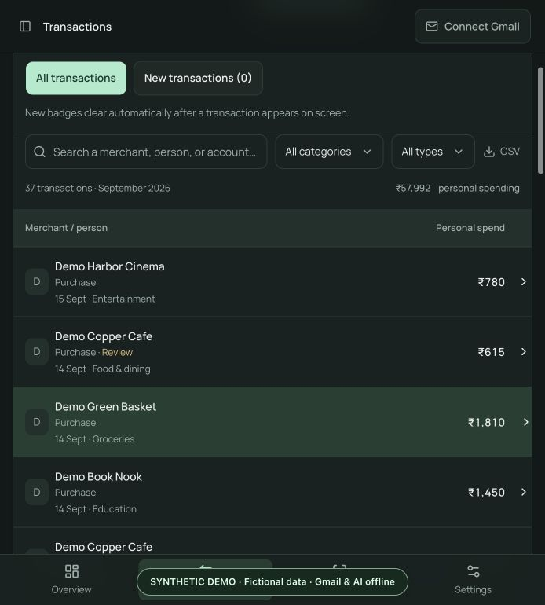
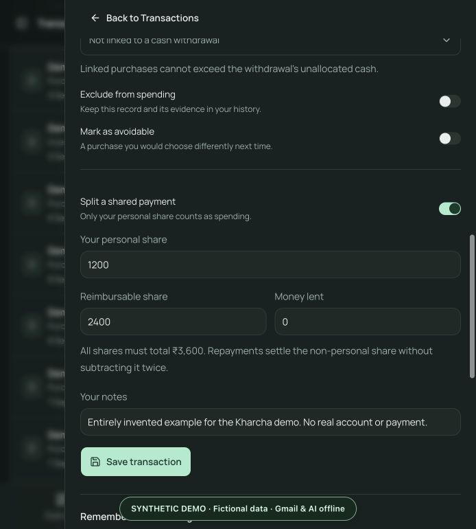
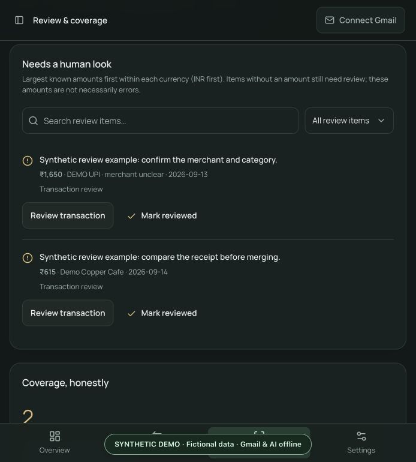

# Try Kharcha with fictional data

Explore the real interface without connecting a mailbox or entering personal
finances. The demo creates its own temporary ledger and memory-only credential
vault. It never opens your normal app database or macOS Keychain.

## Run the demo

From the repository root, install the dependencies and build the interface once:

```sh
python3 -m venv .venv
.venv/bin/python -m pip install -r requirements.lock.txt
npm ci --prefix frontend
npm run build --prefix frontend
.venv/bin/python scripts/demo.py
```

The launcher opens a new demo at `http://127.0.0.1:8875`. Keep its terminal open.
Control-C stops it and removes the temporary ledger. Each launch starts fresh;
demo changes are disposable. It refuses to reuse an occupied port. To choose a
different port, add `--port 8876`.

Your normal app, its settings, and its data directory are independent. The demo
does not use `MONTHLYCOST_DATA_DIR`; there is no option to seed an existing ledger.
Gmail sync, OAuth, real AI, merchant web search, imports, restore, and erase
requests are blocked in the demo. Dependency installation needs internet; the
running demo does not require an external service.

The default fixture ends today in India. To reproduce the screenshots exactly:

```sh
.venv/bin/python scripts/demo.py --as-of 2026-09-15
```

This date produces **299 transactions across March–September 2026**, with
September shown as month to date. The fixed date also controls the demo's
reporting clock. `--check` validates a temporary fixture and exits without
starting a server. `--no-browser` prints the location of a private launch-URL
file for local screenshot tooling; never publish that file or its access token.

## What to explore

| Screen or example | What it demonstrates |
| --- | --- |
| Overview | ₹24,613 in regular September spending, with ₹30,000 in fixed costs and ₹3,379 in unavoidable costs kept separate. |
| Categories and repeated spending | Fictional grocery shops, cafes, transport, shopping, education and subscriptions; click to inspect supporting payments. |
| Full ledger details | Six completed months plus the current month, category/merchant totals, refunds and excluded money movements. |
| Transactions | Search, month and currency selection, category/type filters, manual corrections and CSV export. A fictional USD purchase is also present in the history. |
| Demo Lantern Table · shared dinner | A ₹3,600 payment split into ₹1,200 personal spending and ₹2,400 reimbursable, with a linked repayment. |
| Demo Trail Outfitters · returned item | A linked ₹1,200 refund reduces spending in the month it arrives. |
| Income, transfers, investments and card repayments | Visible in the ledger without being counted as purchases. |
| Review & coverage | Two deliberately unresolved examples: an unclear merchant and a possible duplicate requiring evidence. |
| Supporting evidence | Locally generated fictional source emails from `alerts@example.test`, explicitly marked as demo evidence. |
| What stands out | Prewritten, locally derived illustrations of insight cards; these are **not live AI results**. |

All merchants, people, accounts, payment references, notes and amounts in the
fixture are invented. Demo account suffixes are placeholders. Nothing was
copied from a personal ledger and renamed for these screenshots.

## Screenshot tour

### Spending and transaction explorer

| Regular spending and separate costs | Searchable transaction list |
| --- | --- |
|  |  |

### Shared expenses and evidence review

| Personal and reimbursable shares | Examples that need a human look |
| --- | --- |
|  |  |

## Capture your own screenshots

Launch this demo, verify the **SYNTHETIC DEMO** ribbon, and capture only the app
tab. Let the launch token disappear from the URL before capturing. Keep browser
profiles, other tabs, desktop notifications, terminals, and URL files out of the
image. Use this demo for issues and pull requests as well; never attach actual
bank exports, statements, emails or local browser traces.
